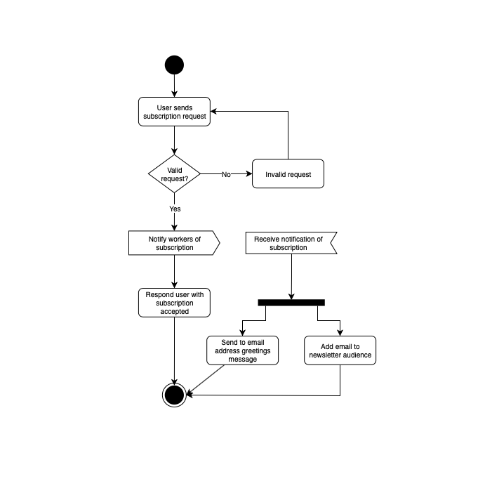
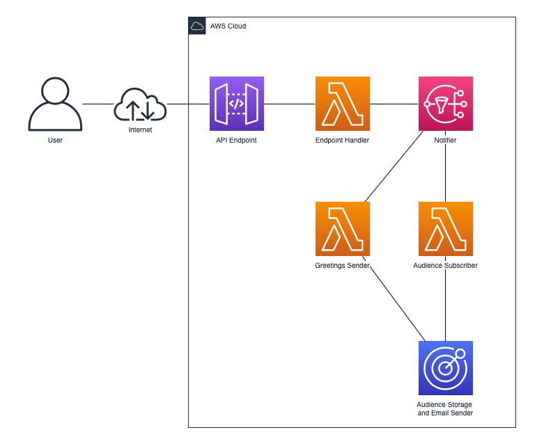

# email-newsletter-subscriber
This repo contains a solution to showcase the use of various AWS services to build a email newsletter subscriber. The solution subscribes a email address to a newsletter by adding it as an endpoint on AWS Pinpoint. It uses the endpoint attributes (see file req-body-example.json and look for MonthlyNlOptStatus) to derive the monthly newsletter audience segment. Also, as part of the subscription workflow, greets the subscriber by sending a transactional email using AWS Pinpoint email message and AWS Pinpoint templates for email content. The solution has a event-driven architecture by using AWS SNS topic to notify subscriptions events and lambda subs to accomplish newsletter subscription workflow. AWS SAM was used to easily deploy a serverless architecture solution.





## How to deploy
Here are two ways to deploy the solution. One is from a development machine and the other is using the `buildspec.yml` in a release process.

### From development machine
First, for this to work, it requires `AWS CLI` and, optionally but highly recommended, `AWS SAM CLI` installed and configured. The profile used to execute the CLI commands must have permission to create s3 buckets, manage cloudformation stacks and manage other services. Can be a user with admin role or inspect the template and give the user of the profile the necessary permissions. It is against the best practices to use the AWS account root user. Also, a working environment of `nodejs 10+` and `npm`.

> Note: This was made on a mac OSX, the commands are bash. 

#### Setup environment
Firstly, create variables to hold values used later by the CLI commands executed. The variables hold the name of the bucket to store code artifacts, the prefix to use as folder on the bucket and the name of the packaged template:

```bash
S3_BUCKET_NAME=SOME_CUSTOM_NAME # Replace with bucket name
S3_PREFIX=SOME_CUSTOM_PREFIX # Replace with prefix, for example: test-build
OUTPUT_TEMPLATE_NAME=packaged.yaml
```

#### Create S3 bucket

Next, we need a `S3 bucket` where we can upload our Lambda functions and layers packaged as ZIP before we deploy anything - If you don't have a S3 bucket to store code artifacts then this is a good time to create one:

```bash
aws s3 mb s3://$S3_BUCKET_NAME
```

#### Build code artifacts

Then `cd` to each project to install dependencies, build and upload code artifacts. The lambda layer `aws-sdk-v2-layer` project have a nodejs folder inside, execute commands from there. Here is a example CLI commands:

```bash
cd PROJECT_FOLDER_NAME # move to the node project. Replace PROJECT_FOLDER_NAME
npm i # install dependencies
S3_BUCKET_NAME=$S3_BUCKET_NAME S3_PREFIX=$S3_PREFIX npm run build # test, build and upload project using devDependency package npm-run-all
```

> Note: can use `sam build` in place of manually moving to each project and executing commands to install dependencies and build. If this is desired then change on the template.yaml Lambdas functions CodeUri and layers ContentUri to have a value of ./PROJECT_FOLDER_NAME . Built artifacts will be written to `.aws-sam/build` folder.

#### Update AWS SAM template
The template needs to know where the code artifacts will be located. Change Lambdas functions CodeUri and layers ContentUri by using the s3 bucket name and s3 prefix as replacement of s3 uri S3_BUCKET_NAME and S3_PREFIX. 

> Note: only do this step if the manually build step was used, not the `sam build` command.

#### Package template

Next, the AWS SAM template needs to be packaged. Use the following AWS SAM CLI command: 

```bash
sam package \
    --template-file template.yaml \
    --output-template-file $OUTPUT_TEMPLATE_NAME \
    --s3-bucket $S3_BUCKET_NAME
```

> Note: can use the command `aws cloudformation package ...` in place of `sam package ...`

#### Deploy packaged template

Lastly, the packaged template needs to be deployed. Use the following AWS SAM CLI command with at least FromEmailAddress value replaced to a verified email: 

```bash
sam deploy \
    --template-file $OUTPUT_TEMPLATE_NAME \
    --stack-name sam-app-example \
    --capabilities CAPABILITY_IAM CAPABILITY_NAMED_IAM CAPABILITY_AUTO_EXPAND \
    --parameter-overrides AppName=NewsletterSubscriber StackStage=Dev FromEmailAddress=EXAMPLE@email.com AllowOrigin=*
```

> Note: can use the command `aws cloudformation deploy ...` in place of `sam deploy ...`

#### Subscription request
Here is an example of how to use the endpoint to subscribe users to the newsletter. This is for making a http post request from a terminal using `curl`. Inspect and modify the `req-body-example.json` file to use valid values, especially the Address field with a valid and verified email.

```bash
curl -H "Content-Type:application/json" \
    -X POST \
    -d @req-body-example.json \
    https://<API_GATEWAY_ENDPOINT_URL>/<STAGE>/subscriptions # Replace <API_GATEWAY_ENDPOINT_URL> and <STAGE> with the values provided by AWS API Gateway. Watch out the /subscriptions path.
```

If everything went correctly, an email for greeting subscriber was sent and an endpoint in the segment for the newsletter can be seen on AWS Pinpoint.

#### Clean up
To stop using resources, delete the stack by using:

```bash
aws cloudformation delete-stack --stack-name sam-app-example
```

### From release process
Firstly, create a AWS CodePipeline to automate the release process. Use as source either a git repo or a AWS S3 bucket containing the solution. As the build server, create a AWS CodeBuild project and use the `buildspec.yml` file for commands and `ENV-stack-configuration.json` file to pass template parameters (inspect and change config file parameters values, especially FromEmailAddress). On the AWS CodeBuild project or on the AWS CodePipeline build step set environment variables for `S3_BUCKET_NAME` which holds the value for code artifacts storage and `S3_PREFIX` which holds the value of bucket folder for code artifacts. Also, modify the `template.yaml` Lambda functions CodeUri and layers ContentUri by replacing the s3 uri S3_BUCKET_NAME and S3_PREFIX with their corresponding values. Lastly, use AWS Cloudformation as deployment step of the pipeline. After finishing with solution, to delete resources go to: AWS Cloudformation to delete created stack, AWS CodePipeline to delete release pipeline, AWS CodeBuild to delete the build project and the code source created to contain the solution.

### Todo
- **Unsubscribe endpoint**: add campaign hook function to modify endpoints by adding a generated token for authN and authZ of unsubscription request. Also add the API endpoint for requests.